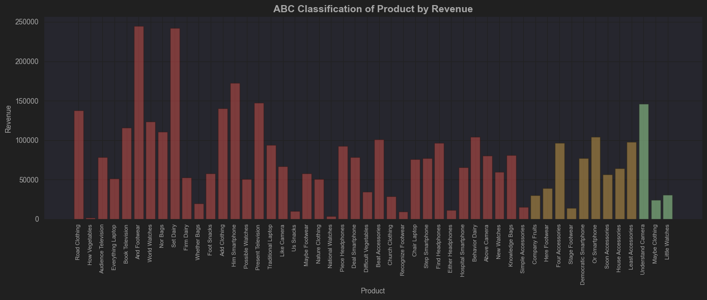
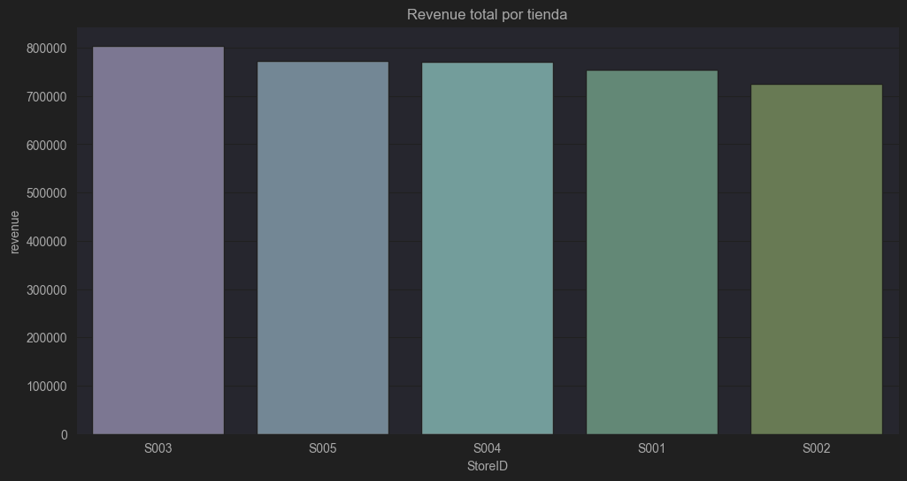
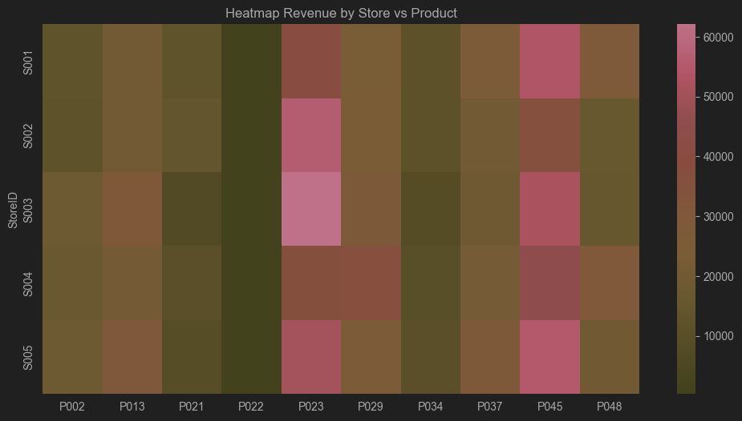

📄 Insights Summary – Retail Sales Analysis

🧩 1. Project Overview

This document summarizes the key findings from the Retail Sales Analysis project.
The analysis uses product, store, and transaction data to uncover revenue drivers, performance patterns, and opportunities for optimization across the retail operation.

📊 2. Key Insights

⭐ 2.1 ABC Classification (Pareto Optimization)

Using the Pareto principle (80/20 rule):

* Category A products represent roughly 20% of the catalog but generate ≈80% of total revenue.
* Category B products represent the next 15% of revenue, providing stable but moderate impact.
* Category C products represent over 50% of the catalog yet contribute less than 5% of revenue.

This indicates that the business is highly dependent on a small group of high-performing SKUs.

📌 Implication: Inventory, pricing, and promotional strategies should be centered around Category A products.

⭐ 2.2 Store Performance Analysis

A store-level revenue comparison reveals:

Top-performing stores:
* S001 and S005, generating the highest total revenue.

Lower-performing stores:
* S002 and S003 show potential but underperform relative to the top stores.

Key patterns:
* High-performing stores tend to carry and successfully sell a larger proportion of Category A products.
* Underperforming stores show gaps in the mix or volume of core SKUs.

📌 Implication: Optimizing product mix per store can significantly increase revenue consistency.

⭐ 2.3 Store–Product Cross Analysis (Heatmap)
A heatmap of Revenue by Store × Product highlights:
* Strong alignment between revenue concentration and A-category products.
* Certain stores (e.g., S002, S003) under-index in key high-impact products.
* Specific product categories drive revenue consistently across multiple stores, suggesting scalable promotional strategies.

📌 Opportunity:
Identify low-penetration A products per store and design targeted strategies (bundles, pricing, placement).

⭐ 2.4 Product Ranking
The top 10 products account for a significant portion of sales volume and revenue.
Key takeaways:
* These products show strong demand across multiple stores.
* Their average price stability suggests mature market acceptance.
* Several lower-selling products show low margins and poor rotation.

📌 Implication:
The product portfolio could be refined by reviewing long-tail products (Category C).

🏁 3. Conclusion
This analysis shows:
* The business depends on few SKU's.
* The performance can be improved by optimization per store.
* Are few products with low rotation that must be reviewed.
* The basis are ready to continue with advanced prediction models and segmentation.

✍️ Author

Cristian Arana
Data Analyst / Data Scientist

🔗 LinkedIn: https://linkedin.com/in/cristian-arana
🐙 GitHub: https://github.com/cristian-arana
